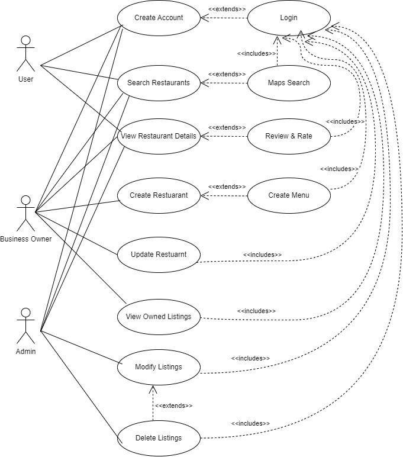
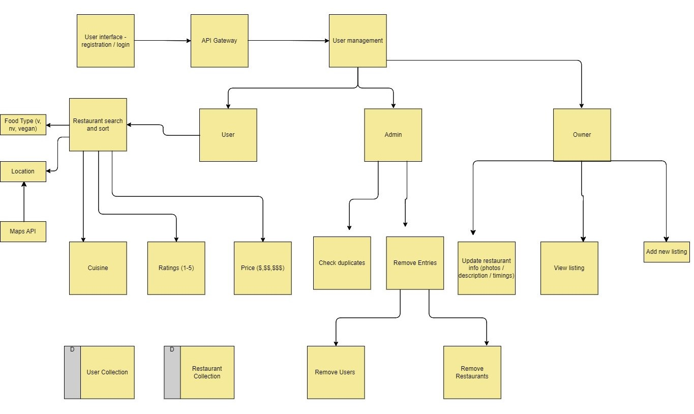
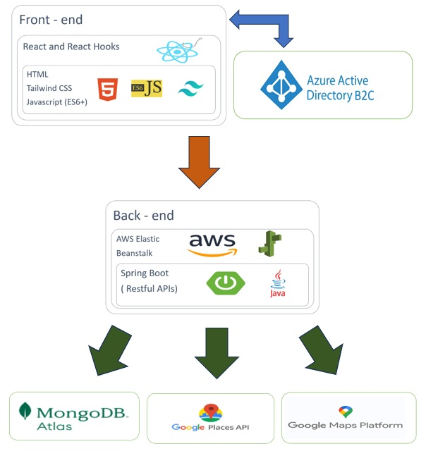
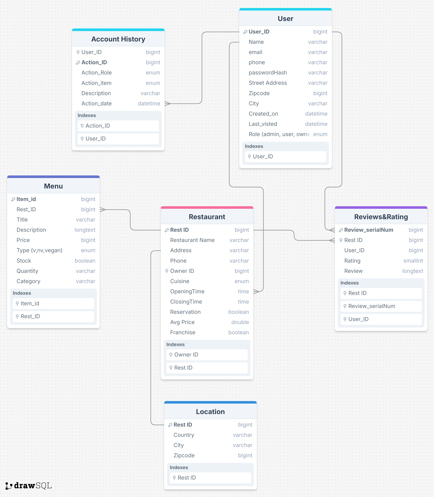
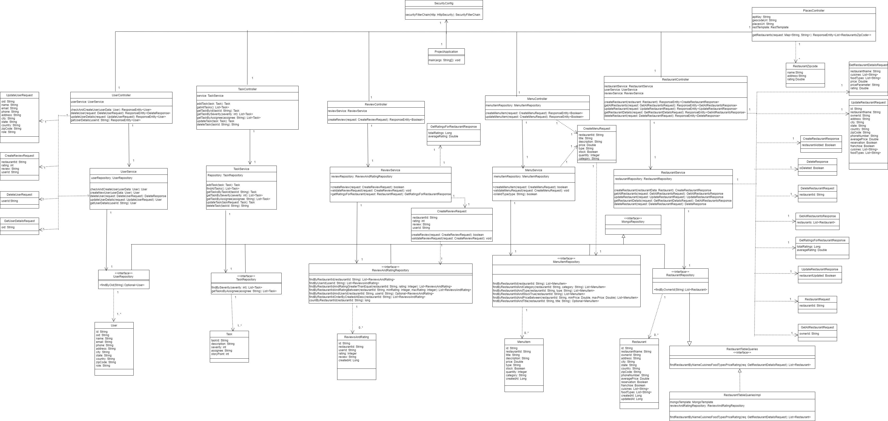
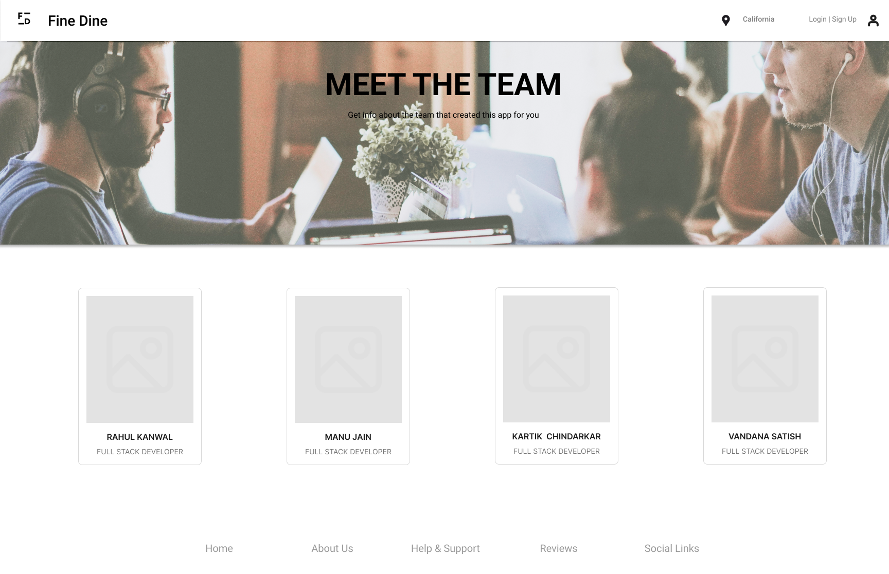

 

  
  

<h1 align="center">FineDine: A Restaurant Finder Application </h1>
  
## Team: AlphaOne

https://github.com/gopinathsjsu/team-project-cmpe202fall24_alphaone 

## About

This project involves developing an application called FineDine: An end-to-end RestaurantFinder application. The main focus is on Team Collaboration, Agile development practices and upolding XP values.

(<a href="#top">👆🏻</a>)

## Team Members and their Contritbutions

| Team Member | SJSU ID |
|-------------|-------------|
| Vandana Satish | 018192941 |
| Rahul Kanwal | 017626882 |
| Kartik Chindarkar | 017583868 |
| Manu Jain | 018171283 |

---
**Rahul Kanwal**: 

1. Designed and documented API contracts for the application.  
2. Performed proof of concept (POC) and implemented the cloud setup for deployment using AWS Elastic Beanstalk.  
3. Conducted POC and created the CI/CD Pipeline using GitHub Actions for automating the deployment process.  
4. Implemented following parts for Normal User flow in front end:
   - ZipCode search using Google Places and Google Geocoding APIs.
   - Restaurant search based on criteria such as price, rating, cuisine, and food type.
   - Individual restaurant page displaying restaurant details along with reviews and rating submission feature.  
5. Created APIs related to User, Restaurant, Review and Rating, and Menu Item in spring boot.  
6. Contributed in creating documentation for the project.  
7. Scheduled DSM calls regularly.  
8. Provided ample support and guidance to team members in completing their tasks.  

--- 
**Manu Jain**:

1. Designed the wireframes for the applications, including user flow for all the main components using Figma.  
2. Implemented following parts for Business User flow in **front end**:  
   - Addition of new restaurants by the business owner.
   - Viewing of listings of restaurants owned by the business owner.
   - Updation of following attributes of the restaurant from the portal:
     - Name
     - Address
     - Contact Information
     - Hours
     - Descriptions
     - Photos
   *Note: All other attributes can also be edited from the edit form*  
3. Created APIs related to User, Restaurant, Review and Rating, and Menu Item in spring boot **backend**.  
4. Contributed in creating documentation for the project.  
5. Scheduled DSM calls regularly.  

---
**Kartik Chindarkar**:

1. Determined the end-to-end technology stack:
   - Frontend: React
   - User Authentication: Azure B2C
   - Backend: Spring Boot
   - Database: MongoDB Atlas
2. Created initial Proof of Concept (POC) to demonstrate feasibility of chosen stack.
3. Frontend Development:
   - Created major UI components
   - Worked on landing pages
   - Developed core UI components, like landing page, profile page, sign up, login, edit and reset password flows.
4. Backend Development:
   - Developed backend APIs
   - Implemented API integration
5. Security Implementation:
   - Implemented API security using JWT-based tokens from Azure B2C
   - Secured API routes
   - Implemented Role-Based Access Control (RBAC)
6. Azure Integration:
   - Developed and integrated Azure services, particularly Azure B2C for user authentication and authorization
---
**Vandana Satish**: 

1. Project management responsibilities were executed, including the management of Daily Scrum Meetings (DSMs).  
2. Current tasks, upcoming tasks, task distribution and backlog documentation were documented and managed.  
3. Extensive project documentation was created, comprising UML Class diagrams, use case diagrams, architecture diagrams, and database schemas.  
4. A project board was maintained, and burn down charts were generated to track progress.  
5. DSM catalogues were compiled, serving as a valuable historical record of daily scrum meetings, decisions, and action items.  
6. Front-end development was undertaken, resulting in the creation of multiple HTML pages. These included:  
   - landing page
   - search page
   - business form page
   - restaurant home page
   - reviews dashboard
   - admin dashboard
   - business owner dashboard
   - meet the team page
7. Admin API integration was implemented, enabling administrators to manage user and restaurant information and maintain admin functionality.  
8. Database entries were made to populate the platform with initial data. User Profiles, Restaurant information and menu data were added and consistency across related data entries was ensured and validated.  
  
(<a href="#top">👆🏻</a>)

---
## Branching Strategy 

To manage and streamline the codebase, the following branching strategy is adopted:

#### 1. Main Branch
- **Purpose:** Holds the final, production-ready version of the code.
- **Rules:**
  - Changes are only merged into main from the develop branch via pull requests (PRs).
  - The branch requires code reviews from team members before merging

#### 2. Develop Branch
- **Purpose:** Acts as the integration branch where team members merge their completed features or bug fixes.
- **Rules:**
  - All team members push their changes to feature branches and create PRs to merge into the develop branch.
  - The develop branch undergoes regular integration testing to ensure stability.
  - Once develop is stable and ready for release, a PR is created to merge it into the main branch.

#### 3. Feature Branches
- **Purpose:** Allow developers to work on individual features or bug fixes without affecting the develop branch.
- **Rules:**
  - Each team member creates their feature branch from the latest version of the develop branch.
  - Regularly rebase or merge the latest develop branch into the feature branch to avoid integration issues.
  - Once work is completed, create a PR to merge the feature branch into develop.

#### Command to find the number of commits: 
    git shortlog -sne --all --no-merges
  - This command when executed gives summary of the commits excluding the merge commits.
  - It is useful when you want to focus on individual contributions.
  - Run command in command prompt of local system, from the project directory.

(<a href="#top">👆🏻</a>)

## Maintain XP core values and practices

- **Foster a Culture of Transparent Dialogue**
 In the development of our Restaurant Finder app, we were committed to creating an environment where team members feel empowered to voice their ideas, concerns, and
suggestions openly. By encouraging honest conversations, we canouldidentify potential issues early and collaboratively find innovative solutions.

- **Implement Regular Feedback Loops**
 We established structured feedback sessions for each feature of the Restaurant Finder app through regular DSMs an KT sessions. These will include:
  - Weekly team check-ins to discuss progress on user interface design
  - Bi-weekly code reviews to ensure backend efficiency
  
- **Embrace Bold Ideas and foster Courage**
 We fostered an atmosphere where team members felt courageous enough to propose unconventional features for the Restaurant Finder app. This might include incorporating both Azure B2C as well as brainstorming on cost-efficient platforms to implement our functionality.

- **Constructive Criticism - Open Communication**
 Encourage team members to provide thoughtful, constructive feedback on all aspects of the Restaurant Finder app. This includes having the courage to respectfully challenge ideas, regardless of who proposes them, to ensure we're creating the best possible product.

- **Celebrate Risk-Taking**
 Recognize and applaud team members who step out of their comfort zones, such as Kartik working on Azure B2C for the first time and despite initial setbacks, Rahul implementing zip code search and front-end integration with no prior experience, Manu working in the backend team as a novice and Vandana doing project management. front-end development as a complete fresher.

(<a href="#top">👆🏻</a>)

## Features

1.	**User Interface:** This component represents the web or mobile UI that users, business owners, and admins interact with. (Using react app)
2.	**API Gateway:** Acts as the entry point for all API requests, handling authentication and routing
3.	**User Management:** Handles user registration, login, and role-based access control for users, business owners, and admins (Azure B2C)
4.	**Restaurant Search:** Manages search functionality, including filtering by name, category, cuisine type, price range, and ratings 
5.	**Review & Rating:** Handles submission and retrieval of reviews and ratings for restaurants
6.	**Business Management:** Allows business owners to add new listings, update information, and manage their restaurant profiles
7.	**Admin Functions:** Provides functionality for admins to check for duplicate listings and remove entries
8.	**Database:** Stores all application data, including user information, restaurant details, reviews, and ratings (MongoDB)
9.	**External Map API:** Integrates with an external mapping service to provide location-based search functionality

(<a href="#top">👆🏻</a>)

## Use Case of Application

(<a href="#top">👆🏻</a>)

## Functional Requirements

(<a href="#top">👆🏻</a>)

## Tech Stack

- **Front-end:** React js, React Hooks Tailwind CSS, Javascript (ES6+)
- **Back-end:** Spring boot 
- **Database:** MongoDB
- **Authentication and Authorization:** Azure B2C 
- **Deployment and Testing:** AWS Elastic Beanstalk 
- **Google Places API**

(<a href="#top">👆🏻</a>)

## Technical Summary & Architecture

(<a href="#top">👆🏻</a>)

## Database Schema 

(<a href="#top">👆🏻</a>)

## UML Class Diagram

(<a href="#top">👆🏻</a>)

## UI Wireframes - Using Figma

**Login Page**

**Landing Page / Zipcode search**

**Restaurant Search Page**

**Restaurant Home Page**

**About Page**

(<a href="#top">👆🏻</a>)

---
## Running the Application 
---

This repository contains two applications:

**React Frontend**: Located in the react-app-finedine/ folder, it serves the client-side user interface.

**Spring Boot Backend**: Located in the springboot-app-finedine/ folder, it serves the server-side API and business logic.

### Prerequisites

Ensure the following are installed on your machine:

#### For React Frontend:
- Node.js: (Recommended version: LTS)
- A package manager: npm (default with Node.js) or yarn.

#### For Spring Boot Backend:
- Java Development Kit (JDK): Version 8 or higher.
- Apache Maven.

#### Optional:
- Git for cloning the repository.

-----------
### Steps:

**1.⁠ ⁠Clone the Repository**

Clone the repository to your local machine:
    `git clone <repository-url>`
    `cd <repository-folder>`

**2.⁠ ⁠Running the React Frontend**
Navigate to the react-app-finedine/ directory:
`cd react-app-finedine`

##### Install dependencies:

**Using npm:** `npm install`
**Using yarn:** `yarn install`

##### Start the development server:

**Using npm:** `npm start`
**Using yarn:** `yarn start`

*The React application will run on http://localhost:3000 by default.*

**3.⁠ ⁠Running the Spring Boot Backend**
***Navigate to the backend/ directory:*** `cd springboot-app-finedine`

###### Build the application:
Run the following command to clean and install dependencies:

`mvn clean install`

###### Start the Spring Boot application:
Using Maven: `mvn spring-boot:run`

***The backend application will run on http://localhost:8080 by default.***

-----------

**4. Running Both Applications Together**

To run the React frontend and Spring Boot backend simultaneously:

Open two terminal windows or tabs.

##### In the first terminal:
Navigate to the react-app-finedine/ directory and start the React application.

##### In the second terminal:
Navigate to the springboot-app-finedine/ directory and start the Spring Boot application.

**Ensure the frontend makes API calls to the correct backend URL. Update the React app's .env file or configuration to use the backend API, e.g.:**

`REACT_APP_API_URL=http://localhost:8080
`

(<a href="#top">👆🏻</a>)

## Project Documentation - Project Board, DSMs, and API contracts

https://drive.google.com/drive/folders/1D6uozfUFCu5Ui6DZjPC_nE_PJ_JMw3YT?usp=drive_link

| File/Folder           | Description                                                                                  | Link                                                                                                   |
|-----------------------|----------------------------------------------------------------------------------------------|--------------------------------------------------------------------------------------------------------|
| Figures              | All figures used in readme.md                                                                | [Figures](https://drive.google.com/drive/folders/1WzL0rCiC1uWxkw5MPu4sPHxq3_MDr3Pr?usp=drive_link)    |
| AlphaOne DSMs        | DSM Call Logs and Meeting Notes                                                              | [AlphaOne DSMs](https://docs.google.com/document/d/1VFfnAurwUxV5GcBxY0nxL3FezO7fcD1EKq24-XLBCbQ/edit?usp=drive_link) |
| Project Board.docx   | Sprint Catalog - Details of the sprint board (Story points, Tasks, Burndown charts, Retrospective) across the entire Development Process | [Project Board.docx](https://docs.google.com/document/d/1bWVtce-4JEneTu02S_AmDpKI61otyaLS/edit?usp=drive_link&ouid=105119814827222629144&rtpof=true&sd=true) |
| Project Board.pdf    | Sprint catalog (in pdf)                                                                      | [Project Board.pdf](https://drive.google.com/file/d/1hkBWw5bg493yovwSCu4F0UWX97RZ6ecE/view?usp=drive_link) |
| Burndown charts.xlsx | Burndown charts for all six sprints (Refer to Project Board for more comprehensive explanation) | [Burndown charts.xlsx](https://docs.google.com/spreadsheets/d/12RzZPDpg_ho_qi0aJcwNDju8c9TNYUuy/edit?usp=drive_link&ouid=105119814827222629144&rtpof=true&sd=true) |
| Burndown charts.pdf  | Burndown charts for all six sprints (Refer to Project Board for more comprehensive explanation) | [Burndown charts.pdf](https://drive.google.com/file/d/1Op3Wdl88BLCO820ssY7o5gAWA--bKiRD/view?usp=drive_link) |
| FineDine API Contract| API Contract: It contains details such as Request, Response, Path, etc. about each API        | [FineDine API Contract](https://docs.google.com/spreadsheets/d/1s6UhX0qDnYW51t4V2E193qIjSi25OGbFlmcuDOZBnE0/edit?usp=drive_link) |
| FineDine APIs.postman_collection.json | This is the postman collection of the APIs which has the postman request of each API of the application. | [FineDine APIs.postman_collection.json](https://drive.google.com/file/d/1EGEW83JGDkGMKvIV8FQhytLpeNYf3vtH/view?usp=drive_link) |

(<a href="#top">👆🏻</a>)

